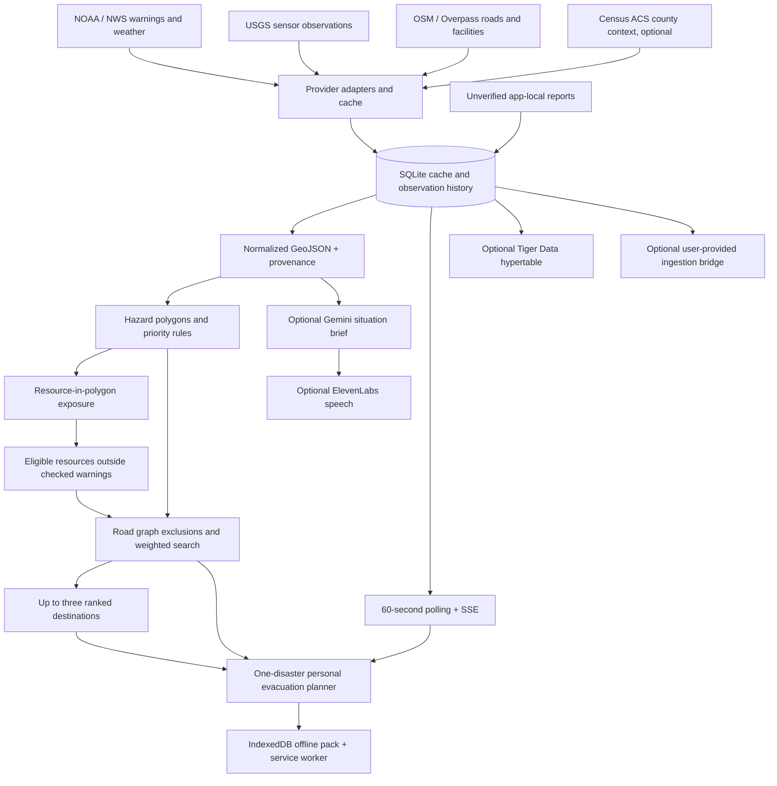

# Architecture and decision rules

## Source meaning and availability

| Source | Scope | Refresh | Interpretation |
| --- | --- | --- | --- |
| NWS alerts | NC alerts relevant to the selected county or geographic window | 5 min | Official warning footprint; not damage or flood depth |
| NWS station | Airport station associated with the city | 5 min | A point observation; not neighborhood heat exposure |
| USGS | One explicitly named river gage per preset | 60 sec | Height relative to local datum; not a flood-stage threshold |
| OSM | A fixed city bounding box | 24 h | Mapped roads and resource candidates; unverified opening/access |
| Census | Selected county, ACS 2024 five-year | 7 days | Baseline population and margin of error, not hazard exposure |

Raleigh's river gage is near Clayton, outside the downtown map window. It is regional monitoring context. It does not create a river-wide risk polygon. Provisional USGS observations can be revised. Latest samples are upserted by station and observation time.

Each source reports `live`, `cached`, `stale`, `unavailable`, `needs-key`, or `simulated`. `cached` means a successful response within the connector refresh interval. On a provider failure, cached data keeps its original last-success timestamp. There is no transition from a failed live query to demo data. A successful response with zero alerts replaces older alerts.

USGS history is loaded for approximately 26 hours. A 24-hour delta requires an observation within one hour of the 24-hour reference. An hourly rate requires a observation within 20 minutes of the one-hour reference. A sample is fresh for at most two hours; actual observation time is always displayed.

## Hazard and exposure engine

Only flood/storm-surge, hurricane/tropical-storm/extreme-wind, and heat events are classified. `Actual` NWS alerts with a future expiry are eligible. Unknown severity stays unrated.

Priority = severity base (Extreme 90, Severe 70, Moderate 45, Minor 20) + urgency (Immediate 10, Expected 5, otherwise 0). This is an explicit triage heuristic, **not** a damage probability or a validated predictive model. Demo scores and boundaries are fictional.

Facility exposure is a point-in-polygon test that handles Polygon, MultiPolygon and GeometryCollection shapes, including holes. A polygon boundary is conservatively included. Resource counts are point-location counts, not people or unique organizations. OSM may contain duplicate mapped representations. No mapped overlap is labeled **Not assessed** rather than safe.

Alerts without polygons can use official affected-zone geometries if all zones are resolved within the request cap. County text can make an alert relevant to a view, but never fabricates a boundary. Relevant unmapped alerts block route calculation. Census totals are kept separate from mapped facility exposure.

## Route engine

Overpass ways form a directed road graph. One-way, reversed one-way and roundabout direction are honored; private/no-access and non-motorized way classes are excluded. Adjacent OSM node IDs establish connectivity; visually crossing roads do not connect unless they share a graph node.

Search minimizes the sum of Haversine segment length × the largest applicable penalty:

- Flood polygon with priority at least 70: remove the intersecting segment.
- Hurricane/wind footprint: cost multiplier 5.
- Heat footprint: cost multiplier 2.
- Other qualifying warning footprint: multiplier 5.
- Unexpired unverified flooded/blocked road or fallen-tree report within 75 m: exclude segment.
- Heat concern within 75 m: multiplier 3.

Whole-segment intersection checks detect polygon crossings even when endpoints are outside. A binary-heap Dijkstra implementation finds the minimum weighted route. If disconnected, it returns no route. Starting points project onto usable road segments within 500 m, including the middle of long roads. A temporary graph node preserves one-way direction. Destination access uses graph nodes within 500 m. Access gaps are checked against exclusions, shown dashed, and explicitly remain unverified.

The personal planner requires an explicit origin and one selected disaster. Live routing checks all known supported hazards; independent demo scenarios check only their selected type. Destinations must be outside every checked warning. Hospitals, clinics, libraries, and community centers are eligible mapped resources. Generic OSM shelters (often picnic or bus shelters), fire stations, and explicitly private/no-access facilities are excluded from destination suggestions. Open status remains unverified. A single graph search evaluates every candidate, returning the three lowest-cost reachable destinations. The result explicitly distinguishes origins inside and outside the selected warning.

The search disallows re-entry into the selected warning after leaving it, checks origin access connectors against exclusions, and rejects destination access points or connectors that overlap warnings. No matching warning, missing boundaries, missing/stale sources, no destinations and disconnected exits return distinct outcomes. NWS and OSM last-success times must be within 15 minutes and 25 hours respectively. Invalid timestamps fail closed.

By default, demo scenarios use the actual OSM driving graph and mapped resource locations. A copied graph adds explicitly simulated dry-road assumptions within the blue flood warning; two red simulated flooded patches still exclude roads and access connections. The live cached graph is never modified. If OSM fails with no cached graph, the demo uses a visibly labeled fictional grid; `DEMO_ROADS=synthetic` also selects that grid for reproducible tests. Both graph and incident must be marked simulated, and personal planning must be in demo mode, before dry-road exceptions apply. Road reports still override them. Demo metadata version 2 prevents old offline packs from silently reusing the limited original network. Real road geometry does not establish current passability.

A second Dijkstra search supplies a shortest-distance comparison for the top three destinations. It retains road access and one-way rules and locks the origin to the same road segment, but omits hazard restrictions. The resulting segments are then checked against the original hazards, reports, and warning re-entry rule to disclose excluded distance and geometry. The comparison is explicitly informational: it cannot replace the selected route or be exported as its geometry. Both distances exclude unverified access gaps. If both searches choose the same path, the UI says so.

The route is experimental: no turn restrictions, live closures, traffic, flood depths, bridge inspection, surface suitability, or safe destination guarantee. A conservative flood exclusion can leave an origin disconnected; the app explains the result rather than manufacturing a straight line. Reports remain unverified even when used for conservative exclusions.

## Offline

The service worker caches local app assets only. User-triggered offline packs store vector roads, resources, conditions and metadata in IndexedDB, isolated by region and mode. OSM tiles are not prefetched or bulk-cached. When offline, the app draws the selected warning and calculated vector route and marks conditions as saved. The same evacuation and graph code runs in the browser. Live offline route calculation rejects incomplete warning coverage and snapshots older than 30 minutes; the source-age limits also apply.

An offline pack is a local copy, not a promise that its information is current. New observations cannot be submitted offline. Changing disasters, origins, modes or regions clears route and briefing state. Report expiry and alert expiry remain enforced. Relevant warning/report/source/road/resource changes invalidate routes; pending requests cannot restore a plan after the user changes context. Live plans expire after 15 minutes.

## Security and deployment boundary

Keys remain in server environment variables. Inputs have size/type/coordinate checks; SQL uses parameters; UI text is escaped; API mutations reject cross-origin browser requests. CSP restricts scripts and network destinations. Public input cannot select upstream URLs, models, voice IDs, or database addresses. Audio uses server-stored generated brief IDs.

The local prototype has no user accounts or report moderation. Add authentication, per-user quotas, authorization, audit policy and moderation before exposing write or paid endpoints on a public service. Put HTTPS in front of the server. Use a persistent disk and one application instance for SQLite.
